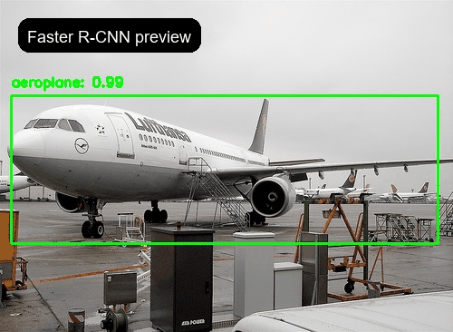

# Object Detection with Faster R-CNN

This repository contains a Faster R-CNN object detection pipeline built with PyTorch and torchvision.  
The project is centered on a Colab notebook that covers dataset handling, preprocessing, training, evaluation, and inference on both images and video.

## Overview

- Backbone: MobileNetV3 with FPN
- Detector: Faster R-CNN
- Dataset style: Pascal VOC 2012 XML annotations
- Output: bounding boxes, class labels, and confidence scores

## Dataset

The notebook uses Pascal VOC-style annotations and a custom dataset wrapper built on top of `torchvision.datasets.VOCDetection`.

- Images are loaded from the VOC 2012 train/validation splits
- Annotations are read from XML files
- Each sample can contain multiple objects
- Bounding boxes are converted to `(xmin, ymin, xmax, ymax)` tensors
- Labels are mapped to the 20 Pascal VOC classes plus `background`

## Preprocessing

The preprocessing pipeline is intentionally lightweight so it stays compatible with torchvision detection models.

- `ToTensor()` converts images to float tensors in the `[0, 1]` range
- Optional augmentations such as `RandomAffine` and `ColorJitter` are included in the notebook
- Targets are returned as dictionaries with tensor fields
- A custom `collate_fn` is used because detection batches can contain different numbers of objects per image

## Model

The detector starts from the pretrained `fasterrcnn_mobilenet_v3_large_320_fpn` architecture and then replaces the classification head with a `FastRCNNPredictor` configured for 21 classes.

- Region Proposal Network handles candidate box generation
- ROI heads perform classification and box regression
- The final predictor is resized for VOC categories

## Training

- Optimizer: SGD
- Learning rate: `0.001`
- Momentum: `0.9`
- Epochs: `10`
- Batch size: `16`

Training metrics:

- Loss is logged to TensorBoard
- Validation uses mean Average Precision (`mAP`)
- Best and last checkpoints are saved in the Drive-backed checkpoint folder used by the notebook

## Inference

The notebook includes two inference demos:

- Single-image inference with drawn bounding boxes and labels
- Video inference that processes frames and writes an annotated output video

## Preview

### Sample preview

### Full videos

- [Open the original MP4 demo](./result%20(2).mp4)

The GIF is shown inline so GitHub can render it directly in the README. The MP4 file remains in the repo as the full-quality demo.

## Notebook

The main workflow is in:

- [`pytorch_faster_CNN_(3).ipynb`](pytorch_faster_CNN_(3).ipynb)

## Project Structure

- `pytorch_faster_CNN_(3).ipynb` - training and inference notebook
- `README.md` - project summary and media preview
- `preview.gif` - inline preview for GitHub README
- `prediction (1).jpg` - sample detection output
- `result (2).mp4` - demo video

## Notes

- The notebook uses Google Colab paths such as `/content/drive/...`
- If you run it locally, update the dataset and checkpoint paths accordingly
- The current repository includes generated preview media so GitHub can show the project results immediately
